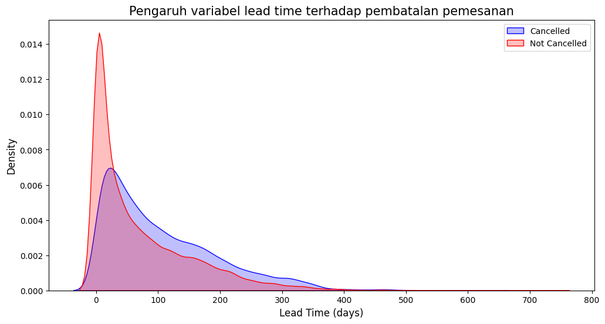

<!-- HEADER -->
<p align='center'>
<a href="#" align='center'>
    
  </a>
<p/>

<p align="center">
  <h3 align="center">
    Analyze Big Data
  </h3>
  <br/>
</p>

## Anggota kelompok

Analisis big data

- Azizah Sisilia Sulandari (202110370311487)
- Nazwa Chantika (202110370311490)
- Miftahul Putra Andiko (202110370311500)

</div>

<!--Daftar Isi-->

## Daftar Isi

- [Pendahuluan](#pendahuluan)
- [Package yang Diperlukan](#package-yang-diperlukan)
- [Data Preparation](#data-preparation)
- [Eksplorasi dan Analisa Data](#eksplorasi-dan-analisa-data)
- [Kesimpulan](#kesimpulan)
  <br><br>

Colab Link : <a href="https://colab.research.google.com/drive/1YadFPP0b8ZR1m1ENgVDnDyDubvUvtoyg?usp=sharing">Click Here</a>

<!--PENDAHULUAN-->

## Pendahuluan

<div align='justify'>
Pemilik dataset "Hotel Booking" yang digunakan pada analysis ini adalah oleh <a href='https://github.com/rfordatascience/tidytuesday/blob/main/data/2020/2020-02-11/readme.md'>TidyTuesday</a> Dataset ini mencakup informasi pemesanan dari dua jenis hotel, yaitu City Hotel dan Resort Hotel. Data ini mencakup berbagai variabel seperti is_canceled, lead_time, adr (Average Daily Rate), customer_type, dan special_requests. Dataset ini memberikan gambaran tentang pola perilaku pelanggan dalam melakukan reservasi hotel, termasuk faktor-faktor yang dapat memengaruhi pembatalan pemesanan. Dengan puluhan variabel yang tersedia, dataset ini menawarkan peluang menarik bagi analis data untuk mendalami karakteristik pemesanan dalam industri perhotelan.
<br>

Namun, kompleksitas data ini juga menghadirkan sejumlah tantangan. Beberapa variabel memiliki distribusi yang tidak merata atau mengandung outlier, sehingga menyulitkan identifikasi pola yang jelas. Selain itu, keberadaan nilai yang hilang atau variabel yang kurang relevan dapat memengaruhi keakuratan hasil analisis dan interpretasi data.
<br>

Untuk mengatasi tantangan tersebut, kami menerapkan berbagai langkah seperti pembersihan data, analisis statistik deskriptif, dan visualisasi data. Pendekatan ini membantu dalam mengidentifikasi faktor utama yang memengaruhi pembatalan reservasi. Tujuan utama penelitian ini adalah untuk memberikan pemahaman yang lebih mendalam tentang pola pemesanan hotel, sehingga pihak manajemen dapat mengambil keputusan yang lebih strategis untuk menurunkan tingkat pembatalan dan meningkatkan efisiensi operasional. Penelitian ini diharapkan dapat memberikan wawasan berharga bagi industri perhotelan dalam menghadapi tantangan pembatalan pemesanan.
<br>

### 1.1 Rumusan Masalah

Berdasarkan latar belakang yang telah dijelaskan, penelitian ini difokuskan pada beberapa pertanyaan utama, yaitu:

1. Apa saja faktor yang memengaruhi pembatalan reservasi hotel, dan bagaimana pola hubungan antar faktor tersebut saling berkaitan?
2. Apakah terdapat perbedaan pola pembatalan reservasi antara jenis hotel, seperti City Hotel dan Resort Hotel?
3. Bagaimana hasil analisis ini dapat dimanfaatkan untuk menekan tingkat pembatalan reservasi sekaligus meningkatkan efisiensi operasional hotel?

### 1.2 Solusi Mengatasi Masalah

Untuk mengatasi permasalahan ini, kami akan memanfaatkan data historis yang mencakup informasi terkait reservasi hotel, seperti status pembatalan, detail pelanggan, serta berbagai parameter lainnya. Langkah-langkah yang direncanakan meliputi:

1. Melakukan pembersihan data untuk menjamin kualitas analisis yang optimal.
2. Menganalisis pola pembatalan yang muncul dalam data.
3. Mengidentifikasi variabel utama yang berperan dalam memengaruhi pembatalan reservasi.

### 1.3 Teknik Analisis yang digunakan

Dalam merumuskan solusi, kami menerapkan teknik analisis berikut:

1. Melakukan pembersihan data dan ringkasan awal untuk memahami struktur serta isi data secara menyeluruh.
2. Menggunakan analisis statistik deskriptif untuk mengenali pola dan tren yang ada.
3. Membuat visualisasi data, seperti histogram dan scatterplot, guna menggambarkan hubungan antara variabel.

### 1.4 Manfaat Analisis

Analisis ini diharapkan dapat memberikan manfaat berikut:

1. Mengembangkan kebijakan pemesanan yang lebih efisien, misalnya dengan menawarkan insentif untuk meminimalkan pembatalan.
2. Mengoptimalkan strategi pemasaran dengan fokus pada kelompok pelanggan yang memiliki kecenderungan lebih tinggi untuk menyelesaikan reservasi.
3. Meningkatkan pengalaman pelanggan melalui pemahaman yang lebih baik terhadap kebutuhan mereka, sehingga dapat mengurangi pembatalan yang disebabkan oleh ketidakpuasan.

</div>
<br>

<!--PACKAGE YANG DIPERLUKAN-->

## Package yang Diperlukan

<div align='justify'>

### 2.1 Colab atau Python

Pada analisis ini, program dijalankan menggunakan platform Google Colab. Namun, jika ingin menjalankannya di IDE lokal, Anda dapat menginstal Python versi 3.12. Untuk informasi lebih lanjut, Anda dapat mengunjungi tautan berikut: <a href="https://www.python.org/downloads/release/python-3100/">klik di sini</a>.

Selain itu, instalasi beberapa library Python juga dibutuhkan. Jika Anda menjalankan program di IDE lokal, Anda dapat menginstal library yang diperlukan melalui terminal Python menggunakan perintah pip. Berikut adalah daftar library yang harus diinstal:

\*Pandas - Latest <br>

```sh
pip install pandas
```

\*Numpy - Latest <br>

```sh
pip install numpy
```

\*Matplotlib - Latest <br>

```sh
pip install matplotlib
```

\*Seaborn - Latest <br>

```sh
pip install seaborn
```

### 2.2 Pesan dan Peringatan yang Dihilangkan

Untuk menjaga notebook tidak menampilkan peringatan yang tidak diperlukan, perintah berikut digunakan:

```sh
import warnings
warnings.filterwarnings('ignore')
```

</div>
<br>

<!--DATA PREPARATION-->

## Data Preparation

<div align='justify'>

### 3.1 Sumber Data

<p align='center'>
<a href="#" align='center'>
    
  </a>
<p/>

Data dalam penelitian ini bersumber dari Github <a href='https://github.com/rfordatascience/tidytuesday/blob/main/data/2020/2020-02-11/readme.md'>TidyTuesday</a>. Dataset ini dapat dikunjungi dengan menekan hyperlink diatas.

### 3.2 Spesifikasi Data

- Tujuan Awal Data : Data ini dikhususkan untuk analisis pemesanan hotel. Data ini dikumpulkan pada `11 Februari 2020` oleh tidytuesday.

- Jumlah Variabel : Dataset ini mencakup 32 variabel. Dictionary data ini adalah sebagai berikut.

| variable                       | class     | description                                                                                                                                                                                                                                                                                                                                                                                                                                |
| :----------------------------- | :-------- | :----------------------------------------------------------------------------------------------------------------------------------------------------------------------------------------------------------------------------------------------------------------------------------------------------------------------------------------------------------------------------------------------------------------------------------------- |
| hotel                          | character | Hotel (H1 = Resort Hotel atau H2 = City Hotel)                                                                                                                                                                                                                                                                                                                                                                                             |
| is_canceled                    | double    | Nilai yang menunjukkan apakah pemesanan dibatalkan (1) atau tidak (0)                                                                                                                                                                                                                                                                                                                                                                      |
| lead_time                      | double    | Jumlah hari yang berlalu antara tanggal masuk pemesanan ke dalam PMS dan tanggal kedatangan                                                                                                                                                                                                                                                                                                                                                |
| arrival_date_year              | double    | Tahun dari tanggal kedatangan                                                                                                                                                                                                                                                                                                                                                                                                              |
| arrival_date_month             | character | Bulan dari tanggal kedatangan                                                                                                                                                                                                                                                                                                                                                                                                              |
| arrival_date_week_number       | double    | Nomor minggu dalam tahun untuk tanggal kedatangan                                                                                                                                                                                                                                                                                                                                                                                          |
| arrival_date_day_of_month      | double    | Hari dalam bulan dari tanggal kedatangan                                                                                                                                                                                                                                                                                                                                                                                                   |
| stays_in_weekend_nights        | double    | Jumlah malam akhir pekan (Sabtu atau Minggu) tamu menginap atau memesan untuk menginap di hotel                                                                                                                                                                                                                                                                                                                                            |
| stays_in_week_nights           | double    | Jumlah malam hari kerja (Senin hingga Jumat) tamu menginap atau memesan untuk menginap di hotel                                                                                                                                                                                                                                                                                                                                            |
| adults                         | double    | Jumlah dewasa                                                                                                                                                                                                                                                                                                                                                                                                                              |
| children                       | double    | Jumlah anak-anak                                                                                                                                                                                                                                                                                                                                                                                                                           |
| babies                         | double    | Jumlah bayi                                                                                                                                                                                                                                                                                                                                                                                                                                |
| meal                           | character | Jenis makanan yang dipesan. Kategori disajikan dalam paket makanan standar perhotelan: <br> Undefined/SC – tidak ada paket makanan; <br> BB – Bed & Breakfast; <br> HB – Half board (sarapan dan satu makanan lainnya – biasanya makan malam); <br> FB – Full board (sarapan, makan siang, dan makan malam)                                                                                                                                |
| country                        | character | Negara asal. Kategori direpresentasikan dalam format ISO 3155–3:2013                                                                                                                                                                                                                                                                                                                                                                       |
| market_segment                 | character | Penunjukan segmen pasar. Dalam kategori, istilah "TA" berarti "Travel Agents" dan "TO" berarti "Tour Operators"                                                                                                                                                                                                                                                                                                                            |
| distribution_channel           | character | Saluran distribusi pemesanan. Istilah "TA" berarti "Travel Agents" dan "TO" berarti "Tour Operators"                                                                                                                                                                                                                                                                                                                                       |
| is_repeated_guest              | double    | Nilai yang menunjukkan apakah nama pemesanan berasal dari tamu yang sudah pernah menginap sebelumnya (1) atau tidak (0)                                                                                                                                                                                                                                                                                                                    |
| previous_cancellations         | double    | Jumlah pemesanan sebelumnya yang dibatalkan oleh pelanggan sebelum pemesanan saat ini                                                                                                                                                                                                                                                                                                                                                      |
| previous_bookings_not_canceled | double    | Jumlah pemesanan sebelumnya yang tidak dibatalkan oleh pelanggan sebelum pemesanan saat ini                                                                                                                                                                                                                                                                                                                                                |
| reserved_room_type             | character | Kode tipe kamar yang dipesan. Kode disajikan untuk menjaga anonimitas                                                                                                                                                                                                                                                                                                                                                                      |
| assigned_room_type             | character | Kode tipe kamar yang diberikan pada pemesanan. Kadang-kadang tipe kamar yang diberikan berbeda dari tipe kamar yang dipesan karena alasan operasional hotel (misalnya overbooking) atau atas permintaan pelanggan. Kode disajikan untuk menjaga anonimitas                                                                                                                                                                                 |
| booking_changes                | double    | Jumlah perubahan/amendemen yang dilakukan pada pemesanan dari saat pemesanan dimasukkan ke PMS hingga saat check-in atau pembatalan                                                                                                                                                                                                                                                                                                        |
| deposit_type                   | character | Indikasi apakah pelanggan membuat deposit untuk menjamin pemesanan. Variabel ini memiliki tiga kategori: <br>No Deposit – tidak ada deposit yang dibuat; <br>Non Refund – deposit dibuat sebesar total biaya menginap; <br>Refundable – deposit dibuat dengan nilai di bawah total biaya menginap                                                                                                                                          |
| agent                          | character | ID agen perjalanan yang membuat pemesanan                                                                                                                                                                                                                                                                                                                                                                                                  |
| company                        | character | ID perusahaan/entitas yang membuat pemesanan atau bertanggung jawab untuk membayar pemesanan. ID disajikan untuk menjaga anonimitas                                                                                                                                                                                                                                                                                                        |
| days_in_waiting_list           | double    | Jumlah hari pemesanan dalam daftar tunggu sebelum dikonfirmasi ke pelanggan                                                                                                                                                                                                                                                                                                                                                                |
| customer_type                  | character | Jenis pemesanan, dengan empat kategori: <br>Contract - ketika pemesanan memiliki alokasi atau jenis kontrak lain yang terkait; <br>Group – ketika pemesanan terkait dengan grup; <br>Transient – ketika pemesanan tidak termasuk dalam grup atau kontrak, dan tidak terkait dengan pemesanan transient lainnya; <br>Transient-party – ketika pemesanan adalah transient, tetapi terkait dengan setidaknya satu pemesanan transient lainnya |
| adr                            | double    | Rata-rata tarif harian yang dihitung dengan membagi jumlah total transaksi penginapan dengan total jumlah malam menginap                                                                                                                                                                                                                                                                                                                   |
| required_car_parking_spaces    | double    | Jumlah ruang parkir mobil yang dibutuhkan oleh pelanggan                                                                                                                                                                                                                                                                                                                                                                                   |
| total_of_special_requests      | double    | Jumlah permintaan khusus yang dibuat oleh pelanggan (misalnya tempat tidur kembar atau lantai tinggi)                                                                                                                                                                                                                                                                                                                                      |
| reservation_status             | character | Status terakhir reservasi, dengan tiga kategori: <br>Canceled – pemesanan dibatalkan oleh pelanggan; <br>Check-Out – pelanggan telah check-in tetapi sudah berangkat; <br>No-Show – pelanggan tidak melakukan check-in dan tidak memberi tahu hotel alasannya                                                                                                                                                                              |
| reservation_status_date        | double    | Tanggal ketika status terakhir ditetapkan. Variabel ini dapat digunakan bersama dengan ReservationStatus untuk memahami kapan pemesanan dibatalkan atau kapan pelanggan check-out dari hotel                                                                                                                                                                                                                                               |

### 3.3 Data Cleaning

Langkah awal dimulai dengan memuat data menggunakan library pandas, yaitu dengan fungsi pandas.read_csv untuk membaca file CSV dari data pemesanan hotel.

Adapun teknik pembersihan data (data cleaning) yang diterapkan meliputi:

- Pemeriksaan data duplikat: Bertujuan untuk memastikan tidak ada data yang berulang, karena data duplikat dapat memengaruhi hasil analisis, baik dalam analisis deskriptif maupun visualisasi.
- Pemeriksaan data kosong (null): Bertujuan untuk menghindari data yang rancu akibat nilai kosong. Jika ditemukan kolom dengan nilai null, maka baris data tersebut akan dihapus.
- Penyesuaian format tanggal: Untuk memperbaiki kesalahan format tanggal agar sesuai dengan standar yang diharapkan. Sebagai contoh, variabel reservation_status_date yang memiliki format tanggal tidak sesuai akan diperbaiki.

### 3.4 Data Cleaned Information

Setelah melalui proses pembersihan data, data yang siap dianalisis memiliki karakteristik berikut:

Jumlah Data (Count):

- Sebanyak 32.830 pemesanan hotel yang dianalisis setelah pembersihan data.
- Tidak ada data yang hilang, karena nilai-nilai kosong telah dihapus atau diimputasi sepenuhnya.
- Variabel yang tidak relevan, seperti agent dan company, telah dihapus untuk meningkatkan efisiensi analisis.

Lead Time:

- Rata-rata (Mean): 104,01 hari, menunjukkan bahwa sebagian besar pemesanan dilakukan jauh sebelum waktu kedatangan.
- Standar Deviasi (Std): 106,68 hari, mencerminkan variasi lead time yang cukup besar.
- Min-Max: 0 - 737 hari, menunjukkan adanya pemesanan yang dilakukan sangat dekat dengan tanggal kedatangan hingga yang dilakukan jauh sebelumnya.
- Median: 69 hari, menunjukkan distribusi lead time sedikit condong ke kanan akibat adanya outlier.

Average Daily Rate (ADR):

- Rata-rata (Mean): 101,83, mencerminkan rata-rata harga harian pemesanan.
- Standar Deviasi (Std): 50,54, menunjukkan variasi harga yang cukup tinggi.
- Min-Max: 0,0 - 5400,0, menunjukkan rentang harga yang sangat lebar, dari sangat murah hingga sangat mahal.
- Median: 94,58, mendekati rata-rata, yang menunjukkan distribusi harga relatif simetris meskipun terdapat beberapa outlier.

Special Requests:

- Rata-rata (Mean): 0,57, menunjukkan bahwa rata-rata tamu membuat sedikit permintaan khusus.
- Standar Deviasi (Std): 0,79, menunjukkan variasi permintaan khusus yang relatif kecil.
- Min-Max: 0 - 5, mencerminkan rentang permintaan dari tidak ada hingga lima permintaan khusus.

Distribusi Data:

- Lead Time: Sebagian besar pemesanan memiliki lead time di bawah 200 hari, dengan beberapa outlier yang sangat panjang.
- ADR: Sebagian besar harga harian berada di kategori rendah hingga sedang, dengan beberapa outlier yang sangat tinggi.
- Special Requests: Mayoritas pesanan memiliki kurang dari dua permintaan khusus.

Insight Penting:

1. Lead time rata-rata yang cukup panjang (104 hari) menunjukkan bahwa mayoritas tamu memesan jauh-jauh hari, meskipun terdapat outlier dengan lead time yang sangat panjang yang perlu dianalisis lebih lanjut.
2. Rata-rata harga harian yang tinggi, ditambah dengan outlier ekstrem, menunjukkan kemungkinan perbedaan signifikan antara City Hotel dan Resort Hotel.
3. Sebagian besar tamu tidak memiliki permintaan khusus atau hanya sedikit, tetapi tamu dengan lebih banyak permintaan khusus cenderung lebih kecil kemungkinannya untuk membatalkan pesanan.

</div>
<br>

<!--EKSPLORASI DAN ANALISA DATA-->

## Eksplorasi Analisis Data dan visualisasi

Storyboard: Memahami Tren Pembatalan Pemesanan Hotel

Hotel memainkan peran penting dalam industri pariwisata dan perjalanan. Setiap tahun, jutaan reservasi hotel dilakukan, dan data ini memberikan peluang untuk menggali wawasan mengenai pola pemesanan serta pembatalan hotel di berbagai belahan dunia.

Melalui berbagai sumber data, seperti sistem reservasi hotel dan umpan balik pelanggan, kita dapat menganalisis tren yang berkontribusi terhadap pembatalan pemesanan.

Dataset ini menyajikan informasi rinci mengenai berbagai faktor, seperti waktu pemesanan, segmen pelanggan, jenis deposit, serta kebiasaan pelanggan.

Dengan mengeksplorasi data tersebut, kita dapat mengidentifikasi pola dan faktor utama yang memengaruhi keputusan pelanggan untuk membatalkan pemesanan hotel.

Berikut hasil analisis:

### - Total pesanan yang diterima dan dibatalkan

<p align='center'>
<a href="#" align='center'>
    
  </a>
<p/>

Pada grafik di atas didapat dari total pemesanan bahwa sebanyak 62931 pemesanan yang diterima dan 23983 pemesanan yang dibatalkan,
sehingga tercatat sebanyak 37% klien yang membatalkan pemesanan hotel tersebut dari total seluruh data yang ada

### - Total pesanan dibatalkan berdasarkan tipe deposit

<p align='center'>
<a href="#" align='center'>
    
  </a>
<p/>

Seperti yang grafik di atas, sebagian besar pemesanan dilakukan dengan opsi "No deposit"

### - Perbandingan jumlah pesanan yang diterima dan dibatalkan antara City Hotel dan Resort Hotel.

<p align='center'>
<a href="#" align='center'>
    
  </a>
<p/>

Pada hasil perbandingan tipe hotel di atas, didapat bahwa City Hotel memiliki lebih banyak pemesanan serta pembatalan pemesanan yang lebih tinggi,
hal ini Mungkin karena Hotel Resort lebih mahal daripada Hotel City.

### - Daftar 10 negara teratas dengan tingkat pembatalan pemesanan tertinggi.

<p align='center'>
<a href="#" align='center'>
    
  </a>
<p/>

dilihat dari visualisasi di atas didapat bahwa:

1. Portugal, Portugal memiliki jumlah terbanyak yang terjadi pembatalan pemesanan yaitu 49.52% dari total 10 negara teratas
2. United Kingdom of Great Britain and Northern Ireland, kedua terjadi pada negara United Kingdom yang terjadi pembatalan pemesanan yaitu 10.05% dari total 10 negara teratas
3. Spanyol, ketika terjadi pada negara spanyol yang terjadi pembatalan pemesanan yaitu 9.42% dari total 10 negara teratas
4. Francis, diikuti perancis yang terjadi pembatalan pemesanan yaitu 8.77% dari total 10 negara teratas

### - Tarif harian rata-rata di city hotel dan resort hotel

<p align='center'>
<a href="#" align='center'>
    
  </a>
<p/>

Grafik garis di atas menunjukkan bahwa pada hari-hari tertentu, tarif harian rata-rata untuk City Hotel lebih rendah dibandingkan dengan tarif harian Resort Hotel. Selain itu, terdapat beberapa hari di mana tarif harian City Hotel bahkan lebih rendah lagi. Hal ini menunjukkan kemungkinan bahwa pada akhir pekan dan hari libur, tarif Resort Hotel cenderung mengalami kenaikan.

### - Pengaruh variabel lead time terhadap pembatalan pemesanan

<p align='center'>
<a href="#" align='center'>
    
  </a>
<p/>

<p align='center'>
<a href="#" align='center'>
    
  </a>
<p/>

Dari informasi grafik di atas menunjukkan:

bahwa pemesanan dengan lead time yang lebih panjang memiliki kecenderungan lebih tinggi untuk dibatalkan, sementara pemesanan dengan lead time yang pendek cenderung lebih jarang dibatalkan. Hal ini terlihat dari rata-rata lead time yang lebih tinggi pada pemesanan yang dibatalkan (105,82 hari) dibandingkan dengan pemesanan yang tidak dibatalkan (70,44 hari).

### - Distribusi status reservasi pada setiap bulan serta pola pembatalan pemesanan berdasarkan bulan.

<p align='center'>
<a href="#" align='center'>
    
  </a>
<p/>

Berdasarkan diagram yang dikelompokkan menurut bulan, terlihat bahwa Agustus mencatatkan jumlah reservasi diterima tertinggi dengan pembatalan yang relatif lebih rendah. Sebaliknya, Januari menunjukkan jumlah reservasi yang diterima paling sedikit, namun memiliki jumlah pembatalan yang tertinggi.

### - Analisis pendapatan rata-rata per hari (ADR) berdasarkan bulan.

<p align='center'>
<a href="#" align='center'>
    
  </a>
<p/>

Pada grafik di atas menggambarkan bahwa pembatalan paling sering terjadi saat harga sedang tinggi dan paling jarang terjadi saat harga sedang rendah. Akibatnya, harga akomodasi tampaknya menjadi faktor utama yang memengaruhi pembatalan.

### - Pengaruh reservation status date terhadap tingkat pembatalan pemesanan.

<p align='center'>
<a href="#" align='center'>
    
  </a>
<p/>

Pada grafik di atas, menunjukkan bahwa pembatalan reservasi lebih sering terjadi saat harga harian rata-rata lebih tinggi dibandingkan dengan reservasi yang tidak dibatalkan. Hal ini mendukung analisis sebelumnya bahwa harga yang lebih tinggi cenderung meningkatkan kemungkinan pembatalan pemesanan.

</div>
<br>

<!--KESIMPULAN-->

## Kesimpulan

<div align='justify'>

### 5.1 Pernyataan Masalah yang Dibahas

Permasalahan utama yang dibahas adalah tingginya tingkat pembatalan pemesanan di industri perhotelan, yang dapat menyebabkan kerugian finansial dan operasional. Tujuan dari analisis ini adalah untuk memahami faktor-faktor yang memengaruhi pembatalan, sehingga langkah-langkah yang tepat dapat diambil untuk mengurangi risiko pembatalan dan meningkatkan efisiensi operasional.

### 5.2 Metodologi yang Digunakan

- Data: Dataset historis yang mencakup informasi tentang pemesanan hotel, termasuk status pembatalan dan parameter terkait, seperti waktu pemesanan, tipe pelanggan, dan rata-rata tarif harian.
- Pendekatan:
  -- Melakukan pembersihan data untuk menangani nilai yang hilang, outlier, serta variabel yang tidak relevan.
  -- Melakukan analisis eksplorasi menggunakan visualisasi data dan statistik deskriptif.
  -- Menyusun tabel dan grafik untuk mengidentifikasi pola pembatalan secara lebih jelas.

### 5.3 Wawasan Menarik yang ditemukan

1. Tipe Pelanggan: Pelanggan grup memiliki kemungkinan pembatalan yang lebih tinggi dibandingkan dengan pelanggan individu (transient).
2. Lead Time: Pemesanan dengan lead time yang lebih panjang memiliki risiko pembatalan yang lebih tinggi.
3. Rata-rata Tarif Harian (ADR): Pesanan dengan harga yang lebih tinggi cenderung lebih sering dibatalkan, mengindikasikan sensitivitas pelanggan terhadap harga.
4. Jenis Hotel: Tingkat pembatalan lebih tinggi pada Resort Hotel dibandingkan dengan City Hotel. Untuk mengatasinya, Resort Hotel dapat menawarkan diskon harga kamar yang lebih menarik pada akhir pekan dan liburan.
5. Permintaan Khusus: Pesanan dengan jumlah permintaan khusus yang lebih banyak cenderung lebih jarang dibatalkan, yang menunjukkan adanya keterlibatan pelanggan yang lebih tinggi.
6. Anomali Musiman: Tingkat pembatalan cenderung meningkat pada bulan Januari. Hotel dapat memanfaatkan ini dengan meluncurkan promosi khusus untuk menarik lebih banyak pelanggan dan meningkatkan pendapatan.

### 5.4 Manfaat analisis

Analisis ini memberikan wawasan strategis yang dapat membantu hotel mengurangi kerugian dan meningkatkan efisiensi operasional, di antaranya:

1. Peningkatan Kebijakan Pemesanan: Mengurangi tingkat pembatalan melalui kebijakan yang lebih fleksibel atau dengan menerapkan penalti untuk pelanggan dengan lead time yang panjang.
2. Strategi Harga yang Optimal: Memberikan diskon untuk pemesanan dengan lead time yang pendek atau menawarkan fleksibilitas lebih untuk pemesanan dengan harga tinggi.
3. Fokus pada Pelanggan Grup: Merancang penawaran atau kontrak yang lebih menarik untuk mengurangi pembatalan pada kategori pelanggan grup.
4. Peningkatan Layanan: Memastikan permintaan khusus pelanggan terpenuhi untuk meningkatkan tingkat keberhasilan reservasi.
5. Penanganan Anomali Musiman: Meluncurkan promosi dan kampanye pemasaran yang menarik pada bulan-bulan dengan tingkat pembatalan tinggi, seperti Januari, untuk meningkatkan pendapatan selama periode sepi.
6. Diskon untuk Resort Hotel: Karena Resort Hotel memiliki tingkat pembatalan yang lebih tinggi dibandingkan City Hotel, memberikan diskon yang lebih kompetitif pada akhir pekan dan hari libur dapat membantu menarik pelanggan dan menurunkan tingkat pembatalan.

</div>
<br>
